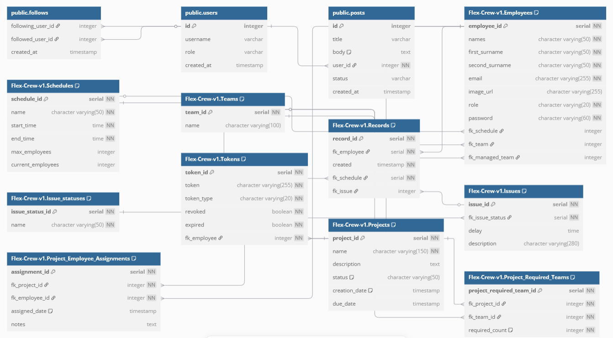
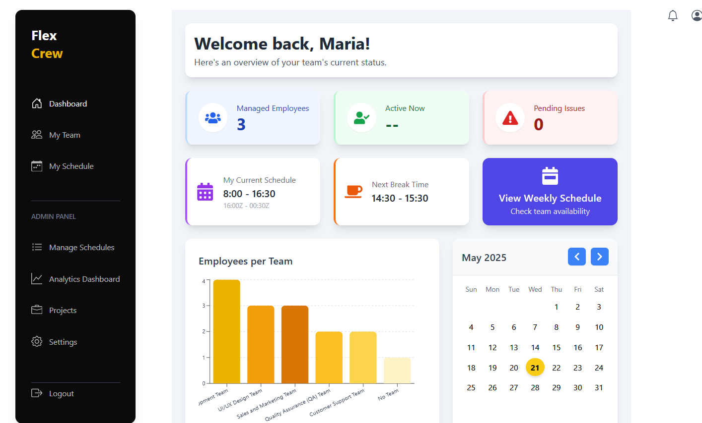

# Flex Crew

Flex-Crew is a comprehensive full-stack web application designed to streamline team management, optimize task scheduling, and track attendance, particularly for businesses operating in flexible and remote work environments. It empowers both employees and managers with tools for efficient work organization, progress monitoring, and optimal resource allocation. The system features distinct dashboards and functionalities tailored to different user roles, facilitating a collaborative and productive workflow.

## Description

This project is a Schedule Optimization tool developed using Spring Boot (Java) for the backend and React (TypeScript) for the frontend. It aims to assist teams in finding optimal schedules within dynamic work settings and helps in maintaining attendance records. The application provides a guided process for schedule optimization and robust tracking capabilities.

**Note:** Flex-Crew is currently under active development. While core functionalities are available, some features planned for future sprints are still being implemented and refined.

## Stack

- Java JDK
  - Spring Boot
- React with TypeScript
  - [React Big calendar](https://www.npmjs.com/package/react-big-calendar)
  - Chakra UI
- PostgreSQL/MySQL/your preferred database (PostgreSQL DDL provided in `./scripts`)

## Running locally

Clone the repo and navigate to the main directory.

### Database

Execute the PostgreSQL DDL provided in `./scripts`.

### Frontend

1. Navigate to `FlexCrew-app/`.
2. Make sure you nave `node` and `npm`, then execute:

```
# Install the dependencies
npm install
```

### Backend

1. Navigate to `backend/`.
2. Create `env.properties` configuration file in `backend/src/main/resources/`. You can use `backend/src/main/resources/env.properties.example` as a template.
3. Fill in your database credentials (DB_HOST, DB_PORT, DB_DATABASE_NAME, DB_USER, DB_PASSWORD, DB_SCHEMA_NAME) and a unique `SECRET_KEY` in your local `env.properties` file.
   **Important:** The `env.properties` file is included in `.gitignore` to protect your sensitive data. Ensure your local copy is not committed.
4. Make sure you have `mvn`, then execute:

```
# Clean the previous output and compile
mvn clean && mvn package
```

## Developing

### Frontend

Run the app and write your changes:

```
# Start the dev server
npm run dev -- --host
```

### Backend

Run the backend REST API:

```
# Start the backend server
mvn spring-boot:run
```

\*\* you need to clean and recompile every change

## Building

Create the production version:

```
# You can preview the production build with npm run preview.
npm run build
```

## Backend Features

- JWT security
- Service Layer
- Password encryption
- Access token and refresh token
- Time restrictions for endpoints

## Frontend Features

- Protected routes (React router)
- JWT expiration proof axios config
- Login and register forms
- Calendar support

## Database Design



## User Interface Mockup

Here is a mockup of the user interface:

### Dashboard



### Login


## Getting Started

To get started with this project, follow these steps:

1. Clone the repository.
2. Setup the database with the provided DDL in `/scripts` folder (PostgreSQL).
3. **Configuration:**
   - For the backend, copy `backend/src/main/resources/env.properties.example` to `backend/src/main/resources/env.properties`.
   - Fill in your database credentials and a `SECRET_KEY` in your local `env.properties` file.
   - **Important:** The `env.properties` file is included in `.gitignore` to protect sensitive data. Ensure your local copy is not committed if you clone this repository and make it public.
4. Run the Spring Boot application.
5. Run the React webapp.
6. Register your email.
7. Access the application.
8. Begin optimizing schedules!

## Dockerization

This project includes `Dockerfile` and `docker-compose.yaml` to facilitate containerized development and deployment.

- **`Dockerfile`**: A multi-stage Dockerfile that builds both the frontend and backend into a final application image.
- **`docker-compose.yaml`**: Orchestrates the application services (backend, frontend development server, database) for a local development environment.

### Running with Docker Compose (for Development)

1.  Ensure Docker and Docker Compose are installed.
2.  Navigate to the project root.
3.  If you haven't already, copy `backend/src/main/resources/env.properties.example` to `backend/src/main/resources/env.properties` and fill in your database details and `SECRET_KEY` in your local `env.properties`. The `docker-compose` setup for the backend expects this file to exist and be correctly populated for database connectivity.
4.  Build and start all services:
    ```bash
    docker-compose up --build
    ```
5.  Access:
    - Backend API: `http://localhost:8081` (Note: Port changed to 8081 as per backend config)
    - Frontend Dev Server: `http://localhost:3000`
6.  Stop services:
    ```bash
    docker-compose down
    ```

For more detailed instructions on manual Docker builds or production deployments, refer to the Docker documentation and the contents of the `Dockerfile`.

## License

This project is licensed under the [MIT License](LICENSE).
